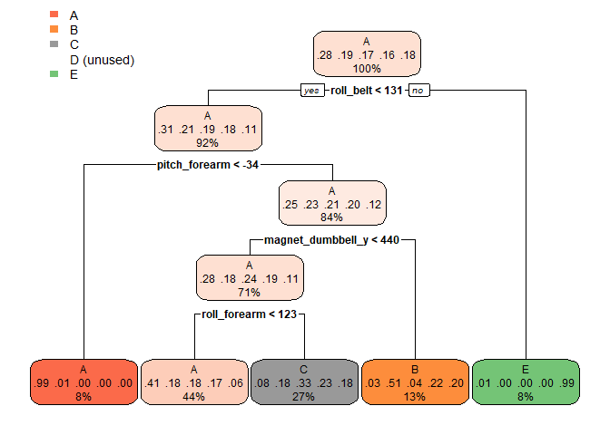

## Introduction

This is my *"PML-Project | Predict activity quality from activity monitors"* for the John Hopkins Data Science Specialization from Coursera. This document outlines the machine learning analysis performed on a data set of exercise routines collected by a wearable device.

The goal of the analysis is to select and build an optimal prediction model to predict 20 test cases in the course.

## Overview of Training and Test Data

In this project, we will use data from accelerometers on the belt, forearm, arm, and dumbell of 6 participants to predict the manner in which they did the exercise. This is the “classe” variable in the training set.

The traing data is available here: 
[Training Data](https://d396qusza40orc.cloudfront.net/predmachlearn/pml-training.csv).

The test data is available here: 
[Test Data](https://d396qusza40orc.cloudfront.net/predmachlearn/pml-testing.csv).

The outcome variable is `classe`, a factor variable with 5 levels. For this data set, participants were asked to perform one set of 10 repetitions of the Unilateral Dumbbell Biceps Curl in 5 different fashions:

- Exactly according to the specification (Class A)
- Throwing the elbows to the front (Class B)
- Lifting the dumbbell only halfway (Class C)
- Lowering the dumbbell only halfway (Class D)
- Throwing the hips to the front (Class E)


## Loading and preprocessing the data

Training and Testing Data is read from online source, load the dataset placed into the working directory.


```r
# Download and read raw data
trainUrl <-"https://d396qusza40orc.cloudfront.net/predmachlearn/pml-training.csv"
testUrl <- "https://d396qusza40orc.cloudfront.net/predmachlearn/pml-testing.csv"
trainFile <- "./data/pml-training.csv"
testFile  <- "./data/pml-testing.csv"
if (!file.exists("./data")) {
  dir.create("./data")
}
if (!file.exists(trainFile)) {
  download.file(trainUrl, destfile=trainFile, method="curl")
}
if (!file.exists(testFile)) {
  download.file(testUrl, destfile=testFile, method="curl")
}
# Import Dataset
trainRaw <- read.csv("./data/pml-training.csv", header=TRUE)
testRaw <- read.csv("./data/pml-testing.csv", header=TRUE)
```

```r
## How much information do we have???
dim(trainRaw)
```

```
## [1] 19622   160
```

```r
dim(testRaw)
```

```
## [1]  20 160
```
The training data set contains 19622 observations and 160 variables, while the testing data set contains 20 observations and 160 variables. The “classe” variable in the training set is the outcome to predict.

```r
## Load libraries
library("lattice")
library("ggplot2")
library("caret")
```

```
## Warning: package 'caret' was built under R version 4.0.5
```

```r
library("rpart")
library("rpart.plot")
```

```
## Warning: package 'rpart.plot' was built under R version 4.0.5
```

```r
library("randomForest")
```

```
## Warning: package 'randomForest' was built under R version 4.0.5
```

```
## randomForest 4.6-14
```

```
## Type rfNews() to see new features/changes/bug fixes.
```

```
## 
## Attaching package: 'randomForest'
```

```
## The following object is masked from 'package:ggplot2':
## 
##     margin
```

```r
## Set properly if different from USA
Sys.setlocale("LC_TIME", "English")
```

```
## [1] "English_United States.1252"
```

```r
# Set seed for reproducability
# set.seed(9999)
```

## Data preparation.

Remove those data that contains more than 95% of the observation to be NA. The step it's to filter out those records.

```r
training_data <- read.csv("./data/pml-training.csv", na.strings=c("NA", "#DIV/0!", ""))
test_data <- read.csv("./data/pml-testing.csv", na.strings=c("NA", "#DIV/0!", ""))
clnColumnIndex <- (colSums(is.na(training_data))/nrow(training_data)) < 0.95
clean_training_data <- training_data[, clnColumnIndex]
```
Verifying the "remove NA" step was correct

```r
colSums(is.na(clean_training_data))/nrow(clean_training_data)
```

```
##                    X            user_name raw_timestamp_part_1 
##                    0                    0                    0 
## raw_timestamp_part_2       cvtd_timestamp           new_window 
##                    0                    0                    0 
##           num_window            roll_belt           pitch_belt 
##                    0                    0                    0 
##             yaw_belt     total_accel_belt         gyros_belt_x 
##                    0                    0                    0 
##         gyros_belt_y         gyros_belt_z         accel_belt_x 
##                    0                    0                    0 
##         accel_belt_y         accel_belt_z        magnet_belt_x 
##                    0                    0                    0 
##        magnet_belt_y        magnet_belt_z             roll_arm 
##                    0                    0                    0 
##            pitch_arm              yaw_arm      total_accel_arm 
##                    0                    0                    0 
##          gyros_arm_x          gyros_arm_y          gyros_arm_z 
##                    0                    0                    0 
##          accel_arm_x          accel_arm_y          accel_arm_z 
##                    0                    0                    0 
##         magnet_arm_x         magnet_arm_y         magnet_arm_z 
##                    0                    0                    0 
##        roll_dumbbell       pitch_dumbbell         yaw_dumbbell 
##                    0                    0                    0 
## total_accel_dumbbell     gyros_dumbbell_x     gyros_dumbbell_y 
##                    0                    0                    0 
##     gyros_dumbbell_z     accel_dumbbell_x     accel_dumbbell_y 
##                    0                    0                    0 
##     accel_dumbbell_z    magnet_dumbbell_x    magnet_dumbbell_y 
##                    0                    0                    0 
##    magnet_dumbbell_z         roll_forearm        pitch_forearm 
##                    0                    0                    0 
##          yaw_forearm  total_accel_forearm      gyros_forearm_x 
##                    0                    0                    0 
##      gyros_forearm_y      gyros_forearm_z      accel_forearm_x 
##                    0                    0                    0 
##      accel_forearm_y      accel_forearm_z     magnet_forearm_x 
##                    0                    0                    0 
##     magnet_forearm_y     magnet_forearm_z               classe 
##                    0                    0                    0
```

```r
colSums(is.na(clean_training_data))
```

```
##                    X            user_name raw_timestamp_part_1 
##                    0                    0                    0 
## raw_timestamp_part_2       cvtd_timestamp           new_window 
##                    0                    0                    0 
##           num_window            roll_belt           pitch_belt 
##                    0                    0                    0 
##             yaw_belt     total_accel_belt         gyros_belt_x 
##                    0                    0                    0 
##         gyros_belt_y         gyros_belt_z         accel_belt_x 
##                    0                    0                    0 
##         accel_belt_y         accel_belt_z        magnet_belt_x 
##                    0                    0                    0 
##        magnet_belt_y        magnet_belt_z             roll_arm 
##                    0                    0                    0 
##            pitch_arm              yaw_arm      total_accel_arm 
##                    0                    0                    0 
##          gyros_arm_x          gyros_arm_y          gyros_arm_z 
##                    0                    0                    0 
##          accel_arm_x          accel_arm_y          accel_arm_z 
##                    0                    0                    0 
##         magnet_arm_x         magnet_arm_y         magnet_arm_z 
##                    0                    0                    0 
##        roll_dumbbell       pitch_dumbbell         yaw_dumbbell 
##                    0                    0                    0 
## total_accel_dumbbell     gyros_dumbbell_x     gyros_dumbbell_y 
##                    0                    0                    0 
##     gyros_dumbbell_z     accel_dumbbell_x     accel_dumbbell_y 
##                    0                    0                    0 
##     accel_dumbbell_z    magnet_dumbbell_x    magnet_dumbbell_y 
##                    0                    0                    0 
##    magnet_dumbbell_z         roll_forearm        pitch_forearm 
##                    0                    0                    0 
##          yaw_forearm  total_accel_forearm      gyros_forearm_x 
##                    0                    0                    0 
##      gyros_forearm_y      gyros_forearm_z      accel_forearm_x 
##                    0                    0                    0 
##      accel_forearm_y      accel_forearm_z     magnet_forearm_x 
##                    0                    0                    0 
##     magnet_forearm_y     magnet_forearm_z               classe 
##                    0                    0                    0
```
Taking out the columns 1 to 7 because they are not related to the prediction model

```r
clean_training_data <- clean_training_data[, -c(1:7)]
clean_test_data <- test_data[, -c(1:7)]
```
Make partition of the "training data" into "training set" and "cross validation set"

```r
inTrainIndex <- createDataPartition(clean_training_data$classe, p=0.75)[[1]]
ttraining_data <- clean_training_data[inTrainIndex, ]
tcrossval_data <- clean_training_data[-inTrainIndex, ]
```
Change the "test dataset" into the same

```r
allNames <- names(clean_training_data)
clean_test_data <- test_data[, allNames[1:52]]
```

## Machine Learning Algorithm - Decision Tree.

Predict with decision tree and output the confusion matrix.

```r
decisionTreeMod <- train(classe ~., method="rpart", data=ttraining_data)
decisionTreePrediction <- predict(decisionTreeMod, tcrossval_data)
confusionMatrix(table(tcrossval_data$classe, decisionTreePrediction))
```

```
## Confusion Matrix and Statistics
## 
##    decisionTreePrediction
##        A    B    C    D    E
##   A 1268   18  104    0    5
##   B  401  316  232    0    0
##   C  395   26  434    0    0
##   D  361  144  299    0    0
##   E  117  109  255    0  420
## 
## Overall Statistics
##                                           
##                Accuracy : 0.4971          
##                  95% CI : (0.4831, 0.5112)
##     No Information Rate : 0.5184          
##     P-Value [Acc > NIR] : 0.9986          
##                                           
##                   Kappa : 0.343           
##                                           
##  Mcnemar's Test P-Value : NA              
## 
## Statistics by Class:
## 
##                      Class: A Class: B Class: C Class: D Class: E
## Sensitivity            0.4988  0.51550   0.3278       NA  0.98824
## Specificity            0.9462  0.85248   0.8824   0.8361  0.89261
## Pos Pred Value         0.9090  0.33298   0.5076       NA  0.46615
## Neg Pred Value         0.6369  0.92491   0.7802       NA  0.99875
## Prevalence             0.5184  0.12500   0.2700   0.0000  0.08666
## Detection Rate         0.2586  0.06444   0.0885   0.0000  0.08564
## Detection Prevalence   0.2845  0.19352   0.1743   0.1639  0.18373
## Balanced Accuracy      0.7225  0.68399   0.6051       NA  0.94042
```
Plotting the decision tree

```r
rpart.plot(decisionTreeMod$finalModel)
```

<!-- -->
It seems like the result of the model is not ideal.

## Machine Learning Algorithm - Random Forest.

Predict with Random Forest and output the Confusion Matrix and Statistics.

```r
rfMod <- train(classe ~., method="rf", data=ttraining_data, ntree=128)
rfPrediction <- predict(rfMod, tcrossval_data)
confusionMatrix(table(tcrossval_data$classe, rfPrediction))
```

```
## Confusion Matrix and Statistics
## 
##    rfPrediction
##        A    B    C    D    E
##   A 1391    3    0    0    1
##   B    5  939    5    0    0
##   C    0    5  846    4    0
##   D    0    0   11  792    1
##   E    0    0    0    0  901
## 
## Overall Statistics
##                                          
##                Accuracy : 0.9929         
##                  95% CI : (0.9901, 0.995)
##     No Information Rate : 0.2847         
##     P-Value [Acc > NIR] : < 2.2e-16      
##                                          
##                   Kappa : 0.991          
##                                          
##  Mcnemar's Test P-Value : NA             
## 
## Statistics by Class:
## 
##                      Class: A Class: B Class: C Class: D Class: E
## Sensitivity            0.9964   0.9916   0.9814   0.9950   0.9978
## Specificity            0.9989   0.9975   0.9978   0.9971   1.0000
## Pos Pred Value         0.9971   0.9895   0.9895   0.9851   1.0000
## Neg Pred Value         0.9986   0.9980   0.9960   0.9990   0.9995
## Prevalence             0.2847   0.1931   0.1758   0.1623   0.1841
## Detection Rate         0.2836   0.1915   0.1725   0.1615   0.1837
## Detection Prevalence   0.2845   0.1935   0.1743   0.1639   0.1837
## Balanced Accuracy      0.9976   0.9945   0.9896   0.9960   0.9989
```

## Prediction base on Machine Learning Algorithms.

Predict using the test set.

```r
predict(rfMod, clean_test_data)
```

```
##  [1] B A B A A E D B A A B C B A E E A B B B
## Levels: A B C D E
```

The "Random Forest algorithm" can by far perform an outcomes more accurate than the "Decision Tree Algorithm". The results from RF are in the 99.25% of accuracy while the DT give almost the 50% in sample accuracy.

## 
## 
